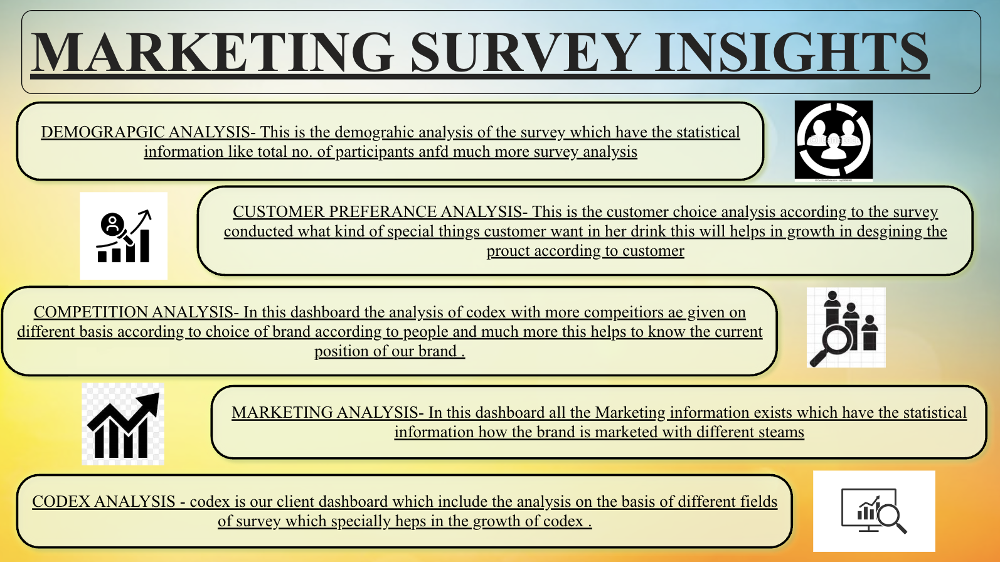
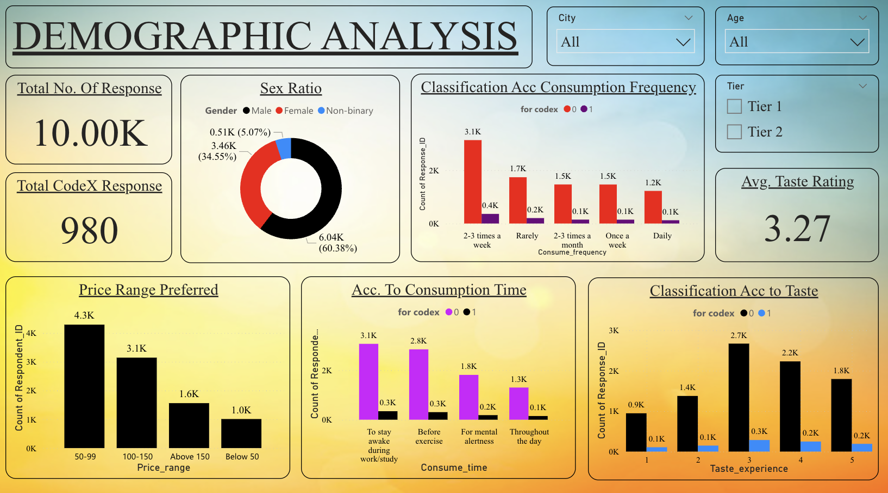
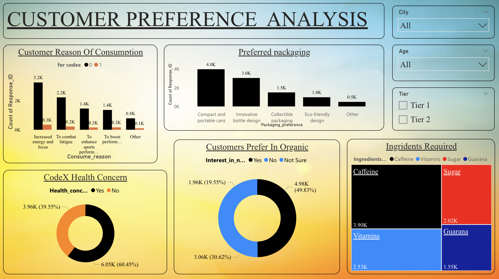
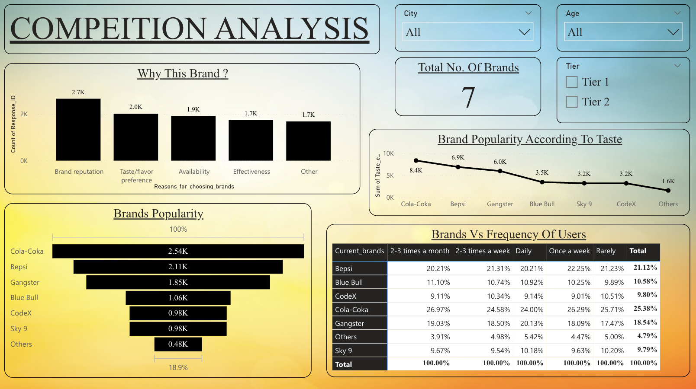
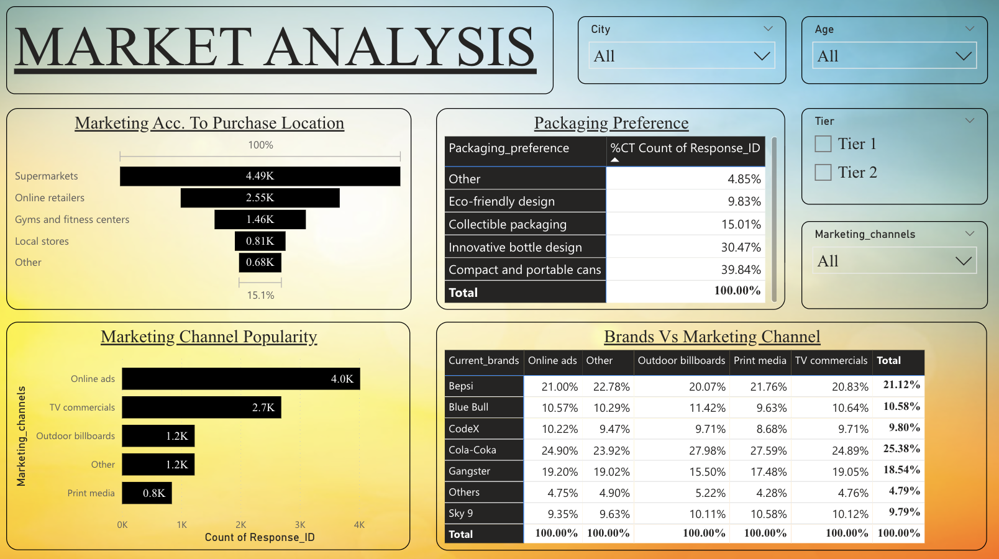
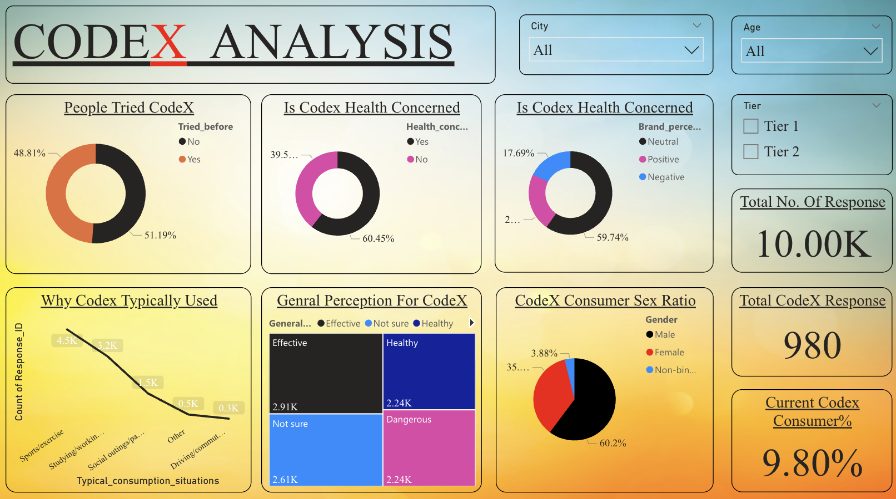

# CodeX Brand Analysis – F&B Market Intelligence Project

## Overview

This project involved building a comprehensive data-driven market intelligence dashboard for **CodeX**, a functional beverage brand, using insights from **10,000+ consumer survey responses**. The goal was to uncover key behavioral patterns, preferences, and competitive benchmarks to inform product development, marketing strategy, and market positioning.

---

## Objectives

- Understand consumer demographics and their usage patterns.
- Analyze brand perception and health-related concerns.
- Identify marketing channel effectiveness across digital, print, and outdoor media.
- Discover packaging and purchase preferences to support product strategy.
- Provide actionable insights for customer retention and market expansion.

---

## Dashboard 

### 1. Introduction

  

### 2. Demographic Analysis

  

### 3. Customer Preference Analysis

 

### 4. Competitor Analysis

 

### 5. Market Analysis

 

### 6. CODEX Analysis

 

---

## Dataset Description

- **Collected Variables**: Age, Gender, Location, Purchase Frequency, Product Ratings, Ingredient Preferences, Brand Awareness, Marketing Recall, and Competitor Perception.
- fact_survey_responses.csv → Consumer responses (10K+ entries)
- dim_cities.csv → City-level metadata
- dim_respondents.csv → Demographic metadata (age, gender, tier)

---

## Key Insights & Deliverables

### 1. Customer Segmentation & Preferences

- Segmented consumers by **gender**, **age group**, and **city tier**.
- Identified the most preferred **price range**: ₹50–₹99, selected by **4.3K users**.
- Calculated an **average taste rating** of **3.27/5**, indicating moderate satisfaction.

### 2. Product & Packaging Insights

- Top **consumption drivers**:  
  - Energy boost (**3.2K users**)  
  - Fatigue recovery (**2.2K users**)
- High demand for **Caffeine-based formulations** (**3.9K mentions**).
- Strong preference for **compact cans** (**4K users**), useful for product packaging decisions.

### 3. Competitive Benchmarking

- Benchmarked CodeX against **6 major competitors** in the functional beverage segment.
- Estimated **market share**: **9.8%** among surveyed users.
- Key **brand loyalty driver**: Brand reputation (cited by **2.7K** users).

### 4. Strategic Recommendations

- Recommended a **health-focused brand repositioning** targeting energy-conscious youth.
- Proposed an optimized **marketing mix** centered around value pricing, functional benefits, and sleek packaging.

### 5. Summary

- 51% of respondents have tried CodeX, with 60% showing health concerns.
- Online ads (40%) and supermarkets (45%) dominate as top channels and purchase points.
- Eco-friendly & portable packaging are the most preferred (70% combined).
- Customer retention opportunities exist via health-focused messaging and digital campaigns.

---

## Tools & Technologies Used

- Data Sources: CSV survey data (fact_survey_responses, dim_cities, dim_respondents)
- Tools: Power BI, SQL, Excel
- Key Skills: ETL, DAX, KPI tracking, data modeling, dashboard design.
  
---

## Business Impact

- This dashboard equips decision-makers to:
- Optimize marketing spend allocation by channel.
- Tailor packaging strategies to consumer preferences.
- Improve brand positioning via targeted messaging.
- Support customer retention and growth strategies.
---

## Contact
- **Akash Kumar Rajak**
- Email: [akashkumarrajak200@gmail.com](mailto:akashkumarrajak200@gmail.com)  
- GitHub: [AkashKumarRajak](https://github.com/AkashKumarRajak) 
- LinkedIn: [AkashKumarRajak](https://www.linkedin.com/in/akash-kumar-rajak-22a98623b/)
---

